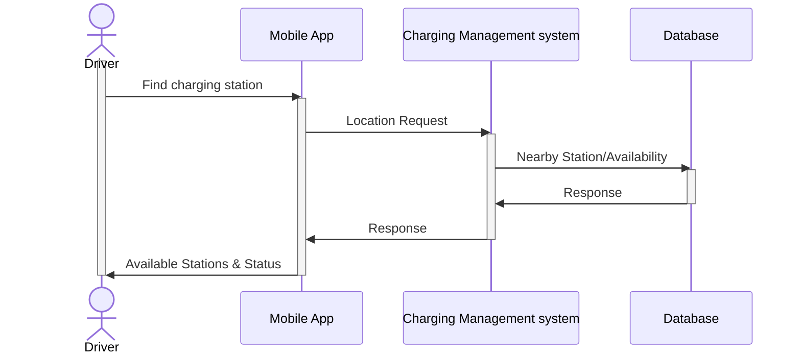
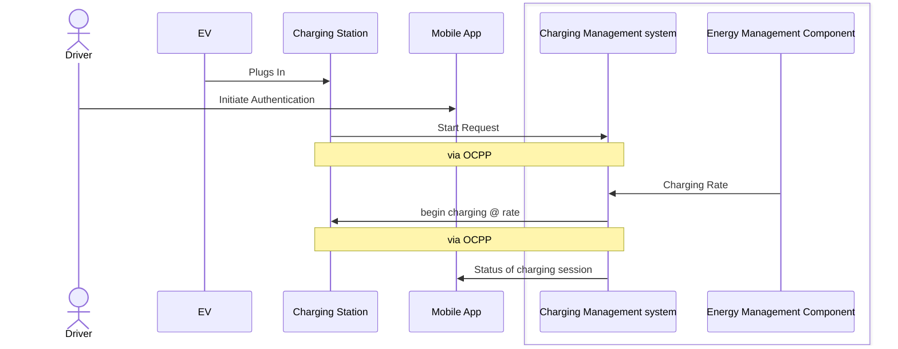

# MoroTechAssignment
## PART-1
This assigment is to document user journey into sequence diagram to represent the interaction and integration among the systems and their component for System integration testing.

### User Journey 1 - Station location
This sequence diagram  shows the process of a mobile app requesting and receiving nearby charging station locations and their realtime availability from a Charging Management System (CMS).  
Assumptions:
    The CMS has access to a database containing station information.
    Diagram does not show the interactions are synchronus or asynchronus.
    The communication between the mobile app and the CMS may be asynchronous.
    The database query may be synchronous.

### User Journey 2 - charging initiation
This sequence diagram  shows the steps involved in initiating a charging session for an electric vehicle.
Assumptions:
    The driver interacts with both the charging station (physically) and the mobile app.
    The communication between the charging station and the CMS is assumed to be synchronous, using the Open Charge Point Protocol (OCPP).
    Diagram does not show the interactions are synchronus or asynchronus.

