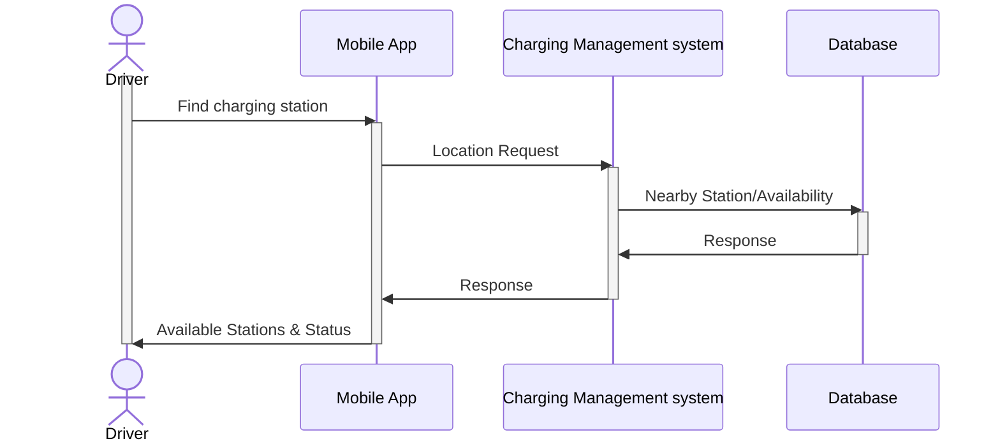
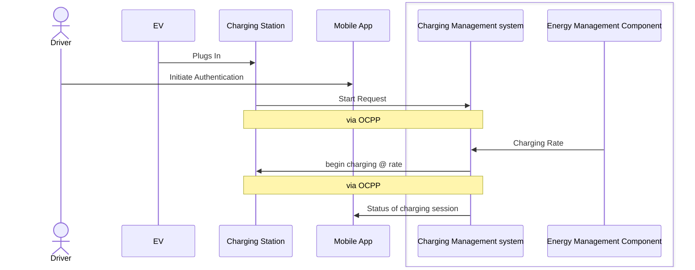

# MoroTechAssignment
## PART-1
This assigment is to document user journey into sequence diagram to represent the interaction and integration among the systems and their component for System integration testing.

### User Journey 1 - Station location
This sequence diagram  shows the process of a mobile app requesting and receiving nearby charging station locations and their realtime availability from a Charging Management System (CMS).  
Assumptions:
    The CMS has access to a database containing station information.
    Diagram does not show the interactions are synchronus or asynchronus.
    The communication between the mobile app and the CMS may be asynchronous.
    The database query may be synchronous.

### User Journey 2 - charging initiation
This sequence diagram  shows the steps involved in initiating a charging session for an electric vehicle.
Assumptions:
    The driver interacts with both the charging station (physically) and the mobile app.
    The communication between the charging station and the CMS is assumed to be synchronous, using the Open Charge Point Protocol (OCPP).
    Diagram does not show the interactions are synchronus or asynchronus.


## PART-2

This assignment is to create API tests for Open Charge Map API; covering two primary endpoints: Get POIs and Get Reference Data. The tests cover response time, status code, response schema and specific business logics. I chose Postman for API testing and exported the collection, which can be run using Newman or Postman. 

### API Endpoints
**Base URL**

Base URL of open charge map API is `https://api.openchargemap.io/v3/`.

Both of the below end points need an API-key as a parameter. 
1. **Get POIs**
* Endpoint: `/poi/`
* Parameters: `latitude,longitude,distance,maxresults and key`.
  
Refer https://openchargemap.org/site/develop/api#/operations/get-poi for details.
2.  **Get Reference Data:**
* Endpoint: `/referencedata/`
* Parameters: `key`
  
Refer https://openchargemap.org/site/develop/api#/operations/get-poi for details.

### Test Cases

### 1. Get POIs Endpoint

* **Response Time and Status Code:**
    * Verifies that the response time is under 1000ms.
    * Confirms that the status code is 200.
* **Schema Validation:**
    * Validates that the response contains an array of POI objects.
    * Each POI object should have the following required fields:
        * ID
        * AddressInfo (containing Latitude and Longitude)
        * NumberOfPoints
* **Business Logic:**
    * Tests that when requesting POIs with `latitude=51.5074&longitude=0.1278&distance=10&maxresults=5`, exactly 5 results are returned.
    * Verifies that all returned POIs are within 10km of the specified coordinates.

### 2. Get Reference Data Endpoint

* **Response Time and Status Code:**
    * Verifies that the response time is under 1000ms.
    * Confirms that the status code is 200.
* **Schema Validation:**
    * Validates that the response contains arrays for different reference data types (e.g., ChargerTypes, StatusTypes).
    * Each item in these arrays should have an ID and Title.
* **Business Logic:**
    * Verifies that the ChargerTypes array contains entries for both "Fast" and "Slow" chargers (based on `IsFastChargeCapable`).
    * Checks that all StatusTypes have a unique ID.
      
## Import and Run

* Newman maybe used for running the collection and/or postman may be used for both viewing and running the collection.
### Importing
* Clone the repository https://github.com/donacj/MoroTechAssignment.git
  
```bash
git clone https://github.com/donacj/MoroTechAssignment.git
```
Alternatively the repository may be downloaded as a zip and then extracted.
      
#### Folder Structure
```
    .
    ├── Collection                 # Compiled files (alternatively `dist`)
    ├── Environment                # Documentation files (alternatively `doc`)
    ├── Report                     # Source files (alternatively `lib` or `app`)
    ├── Dataset                    # Automated tests (alternatively `spec` or `tests`)
    └── README.md
```
### Running with Newman (Command Line)
#### Prerequisites
1.  **Install node.js:**
Download and Install Node.js from https://nodejs.org/en/download for your operating system.

2.  **Install Newman:**
After installing node.js install newman:
```bash
npm install -g newman
```
Refer to https://learning.postman.com/docs/collections/using-newman-cli/installing-running-newman/ for detailed instruction.
3. **API-key**

An API key is required for all requests. Include it as a query parameter: 
?key=YOUR_API_KEY 
To get a valid api key visit the Web URL and inspect the API calls triggered. On the request headers of the 
API calls pointing to the above base url you will find a valid Api key to use for your requests 
This API key has to be entered in the moroTech.postman_envioronment.json in the Environment folder as the value for the key 'variable_key'.

5.  **Run the collection**
Open a terminal in the cloned folder (or the extracted folder) and execute the following command to run the test cases.

```bash
newman run Collection/OpenChargeMapAPI.postman_collection.json -e Environment/moroTech.postman_environment.json -r cli,junit -d Dataset/data.json 
```

This command will run the collection OpenChargeMapAPI.postman_collection.json on the dataset specified by data.json using the environment variables specified in moroTech.postman_environment.json. A junit xml report will be generated in the fodler Report. A cli report also can be viewed on the terminal. 
    
 #### Importing into Postman:

1.  Download the collection file - `OpenChargeMapAPI.postman_collection.json` ( inside collection folder).
2.  Download the environmrnt file -  (`MoroTech.postman_environment.json`)
3.  Open Postman.
4.  Click the "Import" button.
5.  Select "File" and choose the downloaded JSON file.
6.  Import the environment file as well.
7.  Ensure that API key is added to the environment variables.
8.  Run the collection within Postman.
      
## Analysis of Test Results and Observations

#### Get POIs 
* Verified that Status code is 200 consistantly, **Response time is not always under the limit 1000ms.**
* Schema validation: Ensured fields('ID','AddressInfo','NumberOfPoints') are present in response payload.
* Verified that when specifying 'maxresult' as 5, it returns 5 POIs details.
* Verified that all POIs returned are within 10km from specified coordinates.**In some test runs 'AddressInfo.distance' returns null, and the test case is failing.**
#### Get referrence Data
* Verified that Status code is 200 consistantly and response time consistantly comes under 1000ms.
* Schema validation: Ensured the response payload contains arrays of referrence data types like ChargerTypes, StatusTypes, Connectiontypes, Operators, UserTypes etc.
* Verified that ChargerTypes array contains entries for both 'fast' and 'slow' chargers.
* Veriifed thay all the statusType have unique ID.
#### Assumptions and Limitations
* API response time slightly grater than acceptable threshold time to time, it can be due to performance bottleneck.
* API functionalities mostly works: return currect status code, response data inthe expected format, including expected arrays and fields in the response.
* **Assumption:** Assumed that 'AddressInfo.distance' provide the distance from the reference point. Used this value to verify the POIs are within the 10km limit.
* **Limitations:**
* Limited test coverage for 'Get Referrence Data' end point (e.g., not checking for specific chargerTypes, not validating all type of refference data types).
* Collection does not include tests for -ve scenarios like 'invalid API key', 'rate limlting' for identifying issues with APIs error handling
* Collection does not include tests for  expected error status codes and response bodies.
* The distance verification test relies on the AddressInfo.Distance property returned by the API. It doesn't perform independent distance calculations to ensure the API's distance values are accurate.(Improvement: If precise distance verification is crucial, implement own distance calculation logic and compare it with the API's results.) 
 

